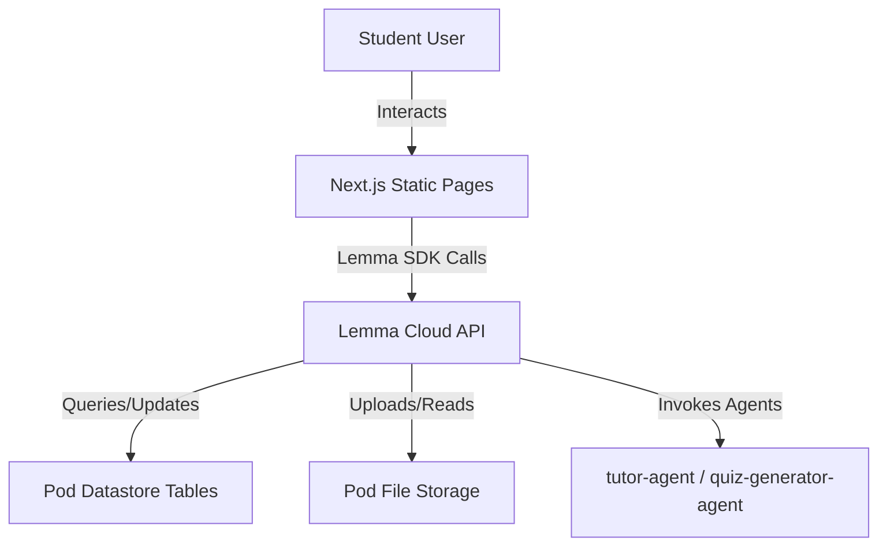

# System Architecture

## Overview
Brainzy runs as a Static App Desk hosted inside a Lemma Pod, communicating client-side via the Lemma TypeScript SDK (`lemma-sdk`).

---

## Technical Stack
- **UI/UX View**: Next.js 16 (App Router), Vanilla CSS, responsive layout configurations.
- **Audio Capture & STT**: Browser native HTML5 `MediaRecorder` API for voice recording and Web Speech `SpeechRecognition` API for live client-side audio transcription.
- **Integration Layer**: `lemma-sdk` initialized client-side inside the browser.
- **Grounding Layer**: `client.conversations` and `client.files` endpoints linking to `tutor-agent` and `quiz-generator-agent` definitions inside the pod.
- **Datastore Layer**: SQLite tables managed via Lemma's datastore records endpoints (`academic_papers`, `flashcards`, `exam_questions`, `user_progress`).

---

## Pod Table Schemas
1. **`academic_papers`**: Stored paper IDs, filenames, titles, file paths, and summaries.
2. **`flashcards`**: Links card IDs, question prompts, answer solutions, and rating difficulties to `academic_papers.id`.
3. **`exam_questions`**: Holds generated quiz questions, options, answers, and explanations.
4. **`user_progress`**: Tracks milestones, manually logged study sessions, and task completion statuses.

